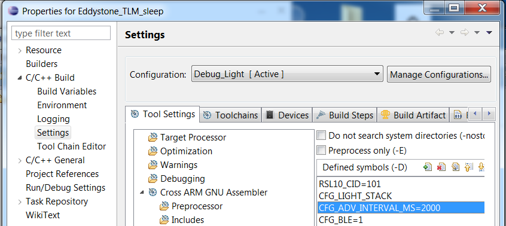
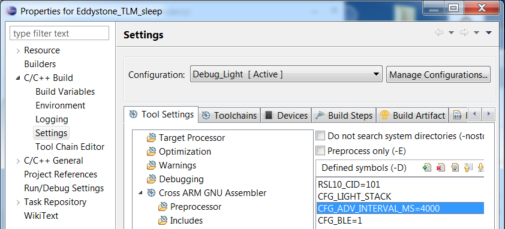
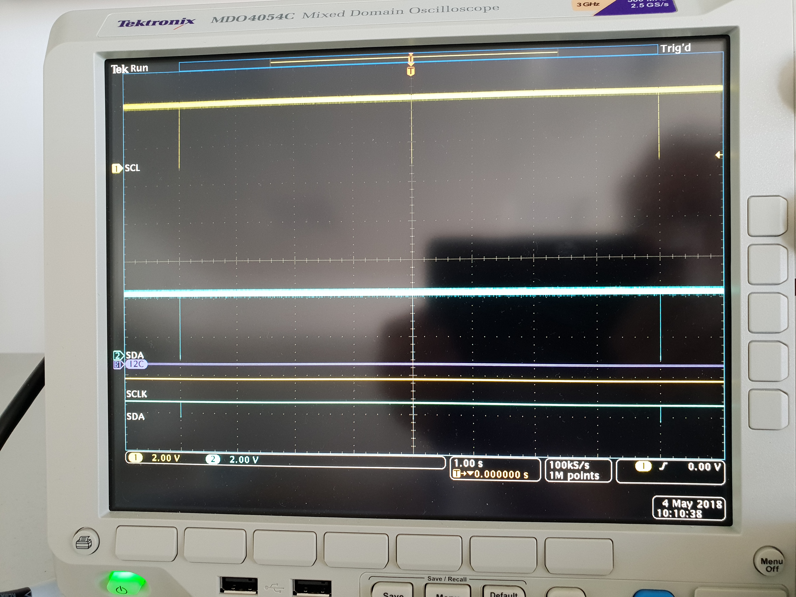
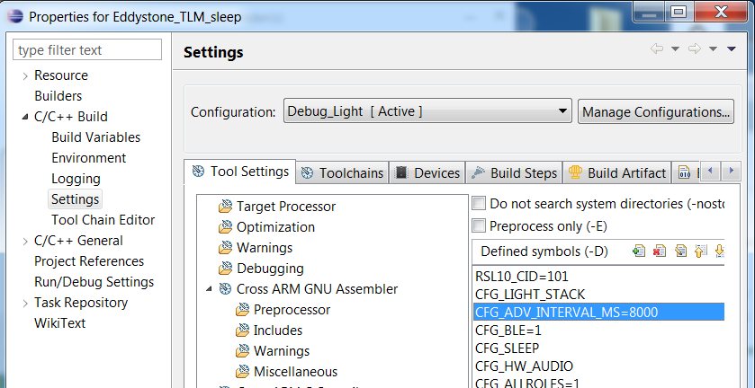
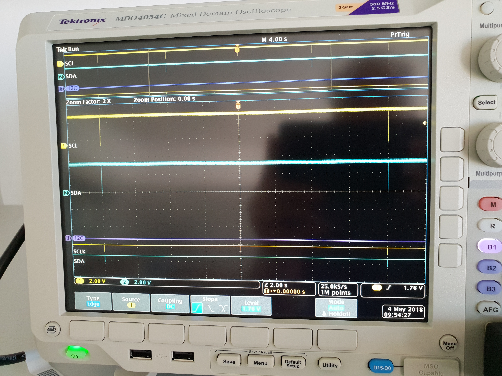

# Eddystone_TLM_sleep
BLE Beacon temperature measurement by NCT375 in One Shot Mode

Used components:
----------------
- SW RSL10 Evalution & Development Tools V1.4
- HW RSL10 QFN EVB V1.1, RSL10 Coin battery advertiser
- Android mobile device with Beaconfig.apk installed
- Temperature sensor NCT375 with I2C slave interface

NCT375 on/off One shot mode switching use macro ONE_SHOT_MODE in nct375.h

Temperature sampling and advertise periods configuration:
---------------------------------------------------------
- Configuration parameter CFG_ADV_INTERVAL_MS=2000 [ms]

- Configuration parameter CFG_ADV_INTERVAL_MS=4000 [ms]

- Configuration parameter CFG_ADV_INTERVAL_MS=8000 [ms]

Sampling interval of android application Beaconfig.apk is shorter. For this configuration sampling has to be started nearly 1-2 second before advertise.